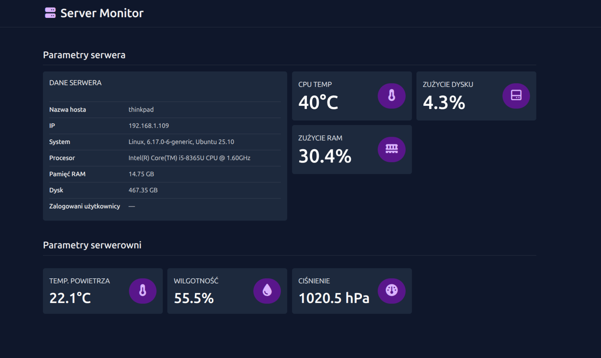

# FastAPI Server Monitor



**FastAPI Server Monitor** to aplikacja do monitorowania serwera i środowiska systemowego, oferująca prosty dashboard w przeglądarce.  
Umożliwia podgląd temperatury CPU, użycia pamięci i dysku, informacji o systemie, użytkownikach oraz danych z czujnika **BME280** podłączonego do Raspberry Pi.

## Funkcjonalności

- **CPU** – marka, architektura, bity, temperatura  
- **Pamięć RAM** – całkowita, użycie, procent  
- **Dysk** – całkowita pojemność, użycie, procent  
- **System** – nazwa systemu, dystrybucja, wersja  
- **Network** – nazwa hosta, adres IP  
- **Raspberry Pi (opcjonalnie)** – temperatura, wilgotność, ciśnienie w serwerowni  
- **Użytkownicy** – lista aktualnie podłączonych użytkowników  
- **Dashboard** – automatyczna aktualizacja danych co kilka sekund 

## Dane środowiskowe z Raspberry Pi


Aby serwer FastAPI mógł odbierać dane środowiskowe (temperatura, wilgotność, ciśnienie), potrzebna jest aplikacja działająca na Raspberry Pi z czujnikiem **BME280**.

Kod źródłowy klienta dostępny tutaj:  
👉 [rpi-bme280-env-monitor](https://github.com/akulewicz/rpi-bme280-env-monitor)

## Instalacja

### Pobranie repozytorium

Sklonuj projekt z GitHuba:

```bash
git clone https://github.com/akulewicz/fastapi-server-monitor.git
cd fastapi-server-monitor
```

Jeśli zamierzasz korzystać z danych z czujnika BM-280 podłączonego z Raspberry Pi wykonaj:

```bash 
mv app/.env.example app/.env
```

W pliku ```app/.env``` wpisz adres IP i port Raspberry Pi.


### Instalacja za pomocą skryptu Bash

W repozytorium znajduje się skrypt instalacyjny install.sh, który:

- instaluje wymagane pakiety Pythona,
- konfiguruje środowisko wirtualne (venv),
- uruchamia aplikację.

Uruchom skrypt:

```bash
chmod +x install.sh
sudo ./install.sh
```

## API

```bash GET /api/status```

Zwraca wszystkie dane systemowe i środowiskowe w formacie JSON.

**Przykład odpowiedzi:**

```json
{
  "cpu": {
    "brand": "Cortex-A72",
    "arch": "ARM_8",
    "bits": 64,
    "temp": 51.6
  },
  "memory": {
    "total": 3981168640,
    "used": 341196800,
    "percent": 8.6
  },
  "disk": {
    "total": 30810230784,
    "used": 4626800640,
    "free": 24889413632,
    "percent": 15.7
  },
  "system": {
    "system": "Linux",
    "release": "6.12.47+rpt-rpi-v8",
    "distro": "Debian GNU/Linux 13 (trixie)"
  },
  "users": {
    "connected_users": [
      {
        "name": "user",
        "host": "(192.168.1.109)"
      },
    ]
  },
  "env": {
    "temperature": 22.1,
    "humidity": 57,
    "pressure": 1020.6
  },
  "network": {
    "hostname": "raspberrypi",
    "ip": "192.168.1.6"
  }
}

```